<div align="center">


<br><br>


<br>

[](./LICENSE)


**A structured, professional Knowledge Management System for Data Analytics, Data Engineering, and AI — from fundamentals to advanced, real-world practice.**

[About](#-about) &bull;
[Structure](#-repository-structure) &bull;
[Roadmap](#-learning-roadmap) &bull;
[Tech Stack](#-tech-stack--skills) &bull;
[Projects](#-featured-projects) &bull;
[Goals](#-goals--future-roadmap) &bull;
[Connect](#-connect-with-me)

</div>

---

## 📖 Table of Contents

- [About](#-about)
- [Why This Repository Exists](#-why-this-repository-exists)
- [Repository Structure](#-repository-structure)
- [Folder Navigation](#-folder-navigation)
- [Learning Roadmap](#-learning-roadmap)
- [Tech Stack & Skills](#-tech-stack--skills)
- [Status Legend](#-status-legend)
- [Featured Projects](#-featured-projects)
- [Goals & Future Roadmap](#-goals--future-roadmap)
- [Repository Rules & Conventions](#-repository-rules--conventions)
- [Contributing](#-contributing)
- [License](#-license)
- [Connect With Me](#-connect-with-me)
- [Repository Stats](#-repository-stats)

---

## 🧭 About

This repository is my **single source of truth** for learning and practicing Data Analytics, Data Engineering, and Artificial Intelligence — from mathematical foundations all the way to cloud platforms, MLOps, and Generative/Agentic AI.

It mirrors a curated folder system I maintain locally, organized into **9 numbered top-level categories** covering everything from my learning roadmap to hands-on projects, datasets, resources, and career preparation.

Instead of scattering notes, courses, and projects across random folders, this repository gives every piece of my learning journey **one clear, predictable home.**

## 💡 Why This Repository Exists

- 🎯 **One system, not ten** — a single place for roadmap, technologies, projects, datasets, resources, and career prep.
- 🧱 **Built to scale** — a numbered, category-based structure designed to stay organized for 5–10+ years, not just this semester.
- 🌱 **Learning in public** — a transparent, evolving record of what I'm learning and building, visible to recruiters, collaborators, and future-me.
- 🔁 **Local ↔ GitHub parity** — this repository is an exact mirror of my local knowledge system, so nothing lives in two conflicting places.

## 🗂 Repository Structure

> **194 folders across 9 top-level categories.** The hierarchy below is **frozen** — the numbering and naming stay stable as content is added over time.

<details>
<summary><strong>Click to expand the full folder tree</strong></summary>

```
Data-Analytics-Knowledge-System
│
├── 01_Learning
│   ├── Career Roadmap
│   ├── Learning Path
│   ├── Course Syllabus
│   ├── Study Plans
│   ├── Career Guides
│   ├── Certification Guides
│   ├── Learning Strategy
│   ├── Study Tracker
│   └── Learning Resources
│
├── 02_Fundamentals
│   ├── Mathematics
│   │   ├── Linear Algebra
│   │   ├── Calculus
│   │   └── Discrete Mathematics
│   ├── Statistics
│   │   ├── Descriptive Statistics
│   │   └── Inferential Statistics
│   └── Probability
│
├── 03_Technologies
│   ├── Programming
│   │   ├── Python
│   │   │   ├── Python Fundamentals
│   │   │   └── Python Libraries (NumPy, Pandas, Matplotlib, Seaborn, Plotly,
│   │   │       Scikit-learn, TensorFlow, PyTorch, OpenCV, XGBoost, CatBoost,
│   │   │       LightGBM, Polars, SciPy, Statsmodels, Requests, Others)
│   │   └── Web Development (Streamlit, Flask, FastAPI)
│   ├── Databases (SQL, MySQL, PostgreSQL, SQL Server, SQLite, MongoDB, Redis)
│   ├── Spreadsheets (Excel)
│   ├── Data Visualization (Power BI, Tableau, Looker Studio, Excel Dashboards)
│   ├── Analytics Concepts (Data Analytics Concepts, Business Analytics, Data Storytelling)
│   ├── Data Engineering
│   │   ├── ETL & ELT
│   │   ├── Data Storage (Data Warehousing, Data Lakes)
│   │   ├── Platforms (Snowflake, Databricks, Microsoft Fabric, dbt)
│   │   └── Big Data (Apache Spark, Apache Airflow)
│   ├── Cloud (Azure, AWS, Google Cloud)
│   ├── AI & Automation (Prompt Engineering, Generative AI, Agentic AI, LangChain,
│   │   LangGraph, Flowise, n8n, MCP, RAG, Vector Databases, Hugging Face,
│   │   AI Workflows, AI Tools)
│   ├── APIs (REST APIs, GraphQL, Webhooks, Authentication, AI APIs)
│   ├── Version Control (Git, GitHub)
│   └── Other Tools
│
├── 04_Projects
│   ├── Tool-wise Projects
│   ├── Domain-wise Projects (Healthcare, Finance, Retail, Manufacturing, Sales,
│   │   Marketing, HR, Logistics, Education, Banking, Insurance, Real Estate,
│   │   Ecommerce, Others)
│   ├── End-to-End Projects
│   ├── AI Projects
│   ├── Business Problems
│   ├── Showcase Projects
│   └── Project Templates
│
├── 05_Datasets
│   ├── Kaggle, Government, Public, Company, Competition
│   └── Synthetic, Practice, Personal, Archive
│
├── 06_Resources
│   ├── Books, PDFs, Official Documentation, Research Papers, White Papers
│   └── Cheat Sheets, Courses, Videos, Blogs, Websites, Newsletters, Templates, References
│
├── 07_Career
│   ├── Resume, GitHub Profile, LinkedIn
│   ├── Interview Preparation (Technical, HR, Coding)
│   ├── Job Preparation, Job Applications, Company Research
│   └── Networking, Salary Research, Freelancing, Internships, Career Planning
│
├── 08_Content Creation
│   ├── LinkedIn Posts, GitHub Content, Articles, Blogs, Tutorials
│   └── Images, Banners, Thumbnails, Content Templates, Content Ideas
│
└── 09_Certifications
    ├── In Progress
    ├── Completed
    ├── Certificates
    └── Practice Exams
```

</details>

## 🧩 Folder Navigation

| # | Folder | Purpose |
|---|--------|---------|
| 🧭 | [`01_Learning`](./01_Learning) | Roadmap, study plans, learning strategy, and certification guides |
| 🧮 | [`02_Fundamentals`](./02_Fundamentals) | Mathematics, Statistics, and Probability — the foundation everything else is built on |
| 🛠️ | [`03_Technologies`](./03_Technologies) | Every tool and technology I use — programming, databases, visualization, data engineering, cloud, AI |
| 🚀 | [`04_Projects`](./04_Projects) | Tool-wise, domain-wise, and end-to-end projects — the applied side of this repository |
| 📦 | [`05_Datasets`](./05_Datasets) | Organized datasets by source — Kaggle, government, public, synthetic, and more |
| 📚 | [`06_Resources`](./06_Resources) | Books, documentation, research papers, courses, and reference material |
| 💼 | [`07_Career`](./07_Career) | Resume, interview prep, job applications, and career planning |
| 🎨 | [`08_Content%20Creation`](./08_Content%20Creation) | LinkedIn posts, articles, tutorials, and content I create while learning in public |
| 🏅 | [`09_Certifications`](./09_Certifications) | Certifications in progress, completed, and certificates earned |

Each top-level folder above also contains its own `README.md` with a more detailed breakdown of what belongs there.

## 🗺 Learning Roadmap

```mermaid
flowchart LR
    A["🧮 Fundamentals<br/>Math · Stats · Probability"] --> B["🐍 Programming<br/>Python · SQL"]
    B --> C["🗄️ Data Handling<br/>Databases · Spreadsheets"]
    C --> D["📊 Visualization<br/>Power BI · Tableau"]
    D --> E["🏗️ Data Engineering<br/>ETL · Warehousing · Spark"]
    E --> F["☁️ Cloud<br/>Azure · AWS · GCP"]
    F --> G["🤖 AI & Automation<br/>ML · GenAI · Agentic AI"]
    G --> H["🚀 Projects & Portfolio"]
```



<sub>Text equivalent for screen readers and non-rendering viewers: Fundamentals → Programming → Data Handling → Visualization → Data Engineering → Cloud → AI & Automation → Projects & Portfolio.</sub>

This roadmap mirrors the [`01_Learning`](./01_Learning) and [`03_Technologies`](./03_Technologies) folders and evolves as my skills grow.

## 🧰 Tech Stack & Skills

<details open>
<summary><strong>Programming & Web</strong></summary>
<br>


</details>

<details open>
<summary><strong>Data & ML Libraries</strong></summary>
<br>


</details>

<details open>
<summary><strong>Databases</strong></summary>
<br>


</details>

<details open>
<summary><strong>Data Visualization</strong></summary>
<br>


</details>

<details open>
<summary><strong>Data Engineering & Big Data</strong></summary>
<br>


</details>

<details open>
<summary><strong>Cloud</strong></summary>
<br>


</details>

<details open>
<summary><strong>AI & Automation</strong></summary>
<br>


</details>

<details open>
<summary><strong>Version Control & Tools</strong></summary>
<br>


</details>

## 🟢 Status Legend

This repository is under **active, continuous development**. Rather than fake progress percentages, every section uses an honest status marker that I keep up to date:

| Status | Meaning |
|--------|---------|
| 🟢 Active | Currently being worked on |
| 🟡 Planned | Scoped and queued, not started yet |
| ⚪ Not Started | Structure exists, content coming soon |
| ✅ Complete | Finished and reviewed |

> Since this system was just established, most sections currently sit at ⚪ **Not Started** — the structure comes first, the content follows. Check back often.

### Progress Tracker

| Category | Status |
|----------|--------|
| [`01_Learning`](./01_Learning) | ⚪ Not Started |
| [`02_Fundamentals`](./02_Fundamentals) | ⚪ Not Started |
| [`03_Technologies`](./03_Technologies) | ⚪ Not Started |
| [`04_Projects`](./04_Projects) | ⚪ Not Started |
| [`05_Datasets`](./05_Datasets) | ⚪ Not Started |
| [`06_Resources`](./06_Resources) | ⚪ Not Started |
| [`07_Career`](./07_Career) | ⚪ Not Started |
| [`08_Content Creation`](./08_Content%20Creation) | ⚪ Not Started |
| [`09_Certifications`](./09_Certifications) | ⚪ Not Started |

## 🚀 Featured Projects

> Project folders are scaffolded and ready in [`04_Projects`](./04_Projects) — entries below will be filled in as each project ships.

| Project | Domain | Stack | Status |
|---------|--------|-------|--------|
| _Coming soon_ | Domain-wise | — | ⚪ Not Started |
| _Coming soon_ | Tool-wise | — | ⚪ Not Started |
| _Coming soon_ | End-to-End | — | ⚪ Not Started |
| _Coming soon_ | AI / Agentic | — | ⚪ Not Started |

## 🎯 Goals & Future Roadmap

<details>
<summary><strong>Near-Term</strong></summary>

- Populate `02_Fundamentals` and `03_Technologies` with structured notes as each topic is studied
- Ship the first project into `04_Projects/Domain-wise Projects`
- Publish the first entries in `08_Content Creation` (LinkedIn posts, articles)

</details>

<details>
<summary><strong>Mid-Term</strong></summary>

- Complete an end-to-end Data Engineering pipeline project (ETL → Warehouse → Dashboard)
- Earn and log the first certification in `09_Certifications`
- Build and ship a Generative AI / Agentic AI project using LangChain / n8n

</details>

<details>
<summary><strong>Long-Term</strong></summary>

- Launch a personal portfolio website that pulls live from this repository
- Connect this system to LinkedIn, GitHub, and n8n for automated content and progress tracking
- Grow this into a public reference other learners can follow

</details>

## 📐 Repository Rules & Conventions

- 🔒 **The folder hierarchy is frozen.** No renaming, deleting, or restructuring of the 9 top-level categories or their subfolders.
- 🔢 **Top-level folders are numbered** (`01_` – `09_`) to keep ordering stable and predictable as the repository grows.
- 📁 **One topic, one folder.** Every technology or subject has exactly one home — no duplicates across categories.
- 🧹 **No clutter.** Only meaningful content is added under each folder; empty folders are preserved with `.gitkeep` until populated.
- 🧾 **Documentation lives at the boundary.** Presentation files (this README, folder guides, license) sit at the root and top level — they never alter the frozen structure underneath.

## 🤝 Contributing

This is primarily a **personal learning repository**, so it isn't open for pull requests in the traditional sense. That said:

- 🐛 Found a broken link or typo? Open an [issue](../../issues).
- 💡 Have a suggestion for a resource, dataset, or project idea? Issues are welcome.
- ⭐ If this structure is useful to you, feel free to fork it and adapt it for your own learning system.

## 📄 License

This repository is licensed under the **MIT License** — see [`LICENSE`](./LICENSE) for details. You're free to use this folder structure as a template for your own knowledge management system.

## 📬 Connect With Me

<div align="center">

[](https://github.com/akxyverse)
[](https://linkedin.com/in/your-linkedin-handle)
[](#)

</div>

> ⚠️ **Note:** the LinkedIn and Portfolio buttons above use placeholder links — replace `your-linkedin-handle` with your real LinkedIn profile URL, and swap the Portfolio badge target once that site is live.

## 📊 Repository Stats

<div align="center">


</div>

---

<div align="center">

**⭐ If this structure is useful to you, consider starring the repo.**

<sub>Built and maintained by <a href="https://github.com/akxyverse">@akxyverse</a> — learning in public, one folder at a time.</sub>

</div>
