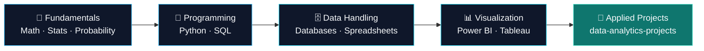

<div align="center">

🏠 [Profile](https://github.com/akxyverse) &bull;
🧠 **Knowledge System** &bull;
🚀 [Projects](https://github.com/akxyverse/data-analytics-projects) &bull;
📦 [Datasets](https://github.com/akxyverse/datasets) &bull;
📚 [Resources](https://github.com/akxyverse/data-analytics-resources) &bull;
💼 [Career](https://github.com/akxyverse/career-hub) &bull;
✍️ [Content](https://github.com/akxyverse/content-studio) &bull;
🏅 [Certifications](https://github.com/akxyverse/certifications) &bull;
🤖 [AI Automation](https://github.com/akxyverse/ai-automation)

</div>

---

<div align="center">


<br><br>


<br>

[](./LICENSE)


**Core Data Analytics learning notes — fundamentals, Python, SQL, BI tools, and analytics concepts. One repository, one purpose: learning core Data Analytics, done properly.**

[About](#-about) &bull;
[Folders](#-folders) &bull;
[Roadmap](#-learning-roadmap) &bull;
[Tech Stack](#-tech-stack--skills) &bull;
[Guidebooks](#-recommended-guidebooks) &bull;
[Ecosystem](#-repository-ecosystem) &bull;
[Connect](#-connect-with-me)

</div>

---

## 📖 Table of Contents

- [About](#-about)
- [Repository Ecosystem](#-repository-ecosystem)
- [Folders](#-folders)
- [Repository Structure](#-repository-structure)
- [Learning Roadmap](#-learning-roadmap)
- [Tech Stack & Skills](#-tech-stack--skills)
- [Recommended Guidebooks](#-recommended-guidebooks)
- [Status Legend](#-status-legend)
- [Repository Rules & Conventions](#-repository-rules--conventions)
- [What's Next](#-whats-next)
- [Contributing](#-contributing)
- [License](#-license)
- [Connect With Me](#-connect-with-me)
- [Repository Stats](#-repository-stats)

---

## 🧭 About

This repository holds my **core Data Analytics learning notes** — mathematical foundations, statistics, Python, SQL, and BI tools. It's intentionally narrow: this is where I learn the fundamentals, not where I store projects, resources, career material, or AI work — those each have their own dedicated home in the [ecosystem](#-repository-ecosystem) below.

My local knowledge system is private; this repository is a **curated, public subset** of it, scoped specifically to core Data Analytics skills.

## 🗺 Repository Ecosystem

This is one of 8 repositories that make up my public Data Analytics presence on GitHub. Each has a single, clear purpose:

| Repository | Purpose |
|---|---|
| [`akxyverse`](https://github.com/akxyverse) | 👋 Profile hub — start here |
| **`data-analytics-knowledge-system`** | 🧠 **You are here** — core DA learning: fundamentals, Python, SQL, BI tools |
| [`data-analytics-projects`](https://github.com/akxyverse/data-analytics-projects) | 🚀 Every hands-on project — tool-wise, domain-wise, end-to-end |
| [`datasets`](https://github.com/akxyverse/datasets) | 📦 Datasets used across projects, organized by source |
| [`data-analytics-resources`](https://github.com/akxyverse/data-analytics-resources) | 📚 Books, docs, papers, courses, cheat sheets |
| [`career-hub`](https://github.com/akxyverse/career-hub) | 💼 Resume, interview prep, applications, career planning |
| [`content-studio`](https://github.com/akxyverse/content-studio) | ✍️ LinkedIn posts, articles, tutorials, content assets |
| [`certifications`](https://github.com/akxyverse/certifications) | 🏅 Certifications in progress, completed, and certificates |
| [`ai-automation`](https://github.com/akxyverse/ai-automation) | 🤖 Generative & Agentic AI, LangChain, n8n, and automation work |

## 🧩 Folders

<table>
<tr>
<td width="50%" valign="top">

### 🧮 Fundamentals of Data Analytics

Mathematics, Statistics, and Probability — the theoretical foundation everything else in this repository is built on. Deliberately scoped to **theory only**, no tools.

**Inside:** Linear Algebra · Calculus · Discrete Mathematics · Descriptive Statistics · Inferential Statistics · Probability

📂 [Open folder](<./Fundamentals of Data Analytics>) &nbsp;·&nbsp; 📄 [Folder guide](<./Fundamentals of Data Analytics/README.md>)

</td>
<td width="50%" valign="top">

### 🛠️ Data Analytics Technologies

Every core tool and technology used in day-to-day analytics work — one home per topic, grouped by category.

**Inside:** Python · SQL & Databases · Excel · Power BI · Tableau · Looker Studio · APIs · Git/GitHub

📂 [Open folder](<./Data Analytics Technologies>) &nbsp;·&nbsp; 📄 [Folder guide](<./Data Analytics Technologies/README.md>)

</td>
</tr>
</table>

## 🗂 Repository Structure

<details>
<summary><strong>Click to expand the full folder tree</strong></summary>

```
data-analytics-knowledge-system
│
├── Fundamentals of Data Analytics
│   ├── Mathematics
│   │   ├── Linear Algebra
│   │   ├── Calculus
│   │   └── Discrete Mathematics
│   ├── Statistics
│   │   ├── Descriptive Statistics
│   │   └── Inferential Statistics
│   └── Probability
│
└── Data Analytics Technologies
    ├── Programming
    │   ├── Python
    │   │   ├── Python Fundamentals
    │   │   └── Python Libraries (NumPy, Pandas, Matplotlib, Seaborn, Plotly,
    │   │       Polars, SciPy, Statsmodels, Requests, Others)
    │   └── Web Development (Streamlit)
    ├── Databases (SQL, MySQL, PostgreSQL, SQL Server, SQLite, MongoDB, Redis)
    ├── Spreadsheets (Excel)
    ├── Data Visualization (Power BI, Tableau, Looker Studio, Excel Dashboards)
    ├── Analytics Concepts (Data Analytics Concepts, Business Analytics, Data Storytelling)
    ├── APIs (REST APIs, GraphQL, Webhooks, Authentication)
    ├── Version Control (Git, GitHub)
    └── Other Tools
```

</details>

## 🗺 Learning Roadmap



<sub>Text equivalent for screen readers / non-rendering viewers: Fundamentals → Programming → Data Handling → Visualization → Applied Projects (in the dedicated projects repository).</sub>

This repository covers the first four stages. The fifth — applying it — happens in [`data-analytics-projects`](https://github.com/akxyverse/data-analytics-projects).

## 🧰 Tech Stack & Skills

<details open>
<summary><strong>Programming & Web</strong></summary>
<br>


</details>

<details open>
<summary><strong>Core Data Libraries</strong></summary>
<br>


</details>

<details open>
<summary><strong>Databases</strong></summary>
<br>


</details>

<details open>
<summary><strong>Data Visualization</strong></summary>
<br>


</details>

<details open>
<summary><strong>Version Control</strong></summary>
<br>


</details>

> Looking for TensorFlow, PyTorch, Scikit-learn, Cloud, Data Engineering, or Generative/Agentic AI? Those live locally for now (ML/DL) or in [`ai-automation`](https://github.com/akxyverse/ai-automation) — not in this repository, by design.

## 📘 Recommended Guidebooks

Standalone, self-contained guides that go deeper than what's tracked as notes in this repository:

| Guide | What it covers |
|---|---|
| 📊 [**Excel Roadmap Guide**](https://github.com/akxyverse/excel-roadmap-guide) | A step-by-step Excel roadmap — 30 skills across 4 levels, from basics to Data Analyst-ready |

> Kept as its own repository rather than folded in here — it's a complete learning product with its own structure and audience, not raw notes.

## 🟢 Status Legend

| Status | Meaning |
|--------|---------|
| 🟢 Active | Currently being worked on |
| 🟡 Planned | Scoped and queued, not started yet |
| ⚪ Not Started | Structure exists, content coming soon |
| ✅ Complete | Finished and reviewed |

### Progress Tracker

| Category | Status |
|----------|--------|
| [Fundamentals of Data Analytics](<./Fundamentals of Data Analytics>) | ⚪ Not Started |
| [Data Analytics Technologies](<./Data Analytics Technologies>) | ⚪ Not Started |

## 📐 Repository Rules & Conventions

- 🔒 **The folder hierarchy is frozen.** No renaming, deleting, or restructuring of the top-level categories or their subfolders beyond what's already been deliberately set.
- 🎯 **Scope is deliberately narrow.** Only core Data Analytics learning content lives here — projects, resources, career material, and AI/automation work all live in their own repositories.
- 📁 **One topic, one folder, one repository.** Every technology has exactly one home across the whole ecosystem — no duplicates.
- 🧹 **No clutter.** Only meaningful content is added under each folder; empty folders are preserved with `.gitkeep` until populated.

## 🚀 What's Next

- 📖 **Studying?** Start with [Fundamentals of Data Analytics](<./Fundamentals of Data Analytics>), then move to [Data Analytics Technologies](<./Data Analytics Technologies>).
- 🛠️ **Want to see this applied?** Head to [`data-analytics-projects`](https://github.com/akxyverse/data-analytics-projects) for hands-on work built on these fundamentals.
- 📊 **Learning Excel specifically?** The [Excel Roadmap Guide](https://github.com/akxyverse/excel-roadmap-guide) is a deeper, structured path.
- ⭐ **Found this useful?** Star the repo and follow [@akxyverse](https://github.com/akxyverse) for the rest of the ecosystem.

## 🤝 Contributing

This is a **personal learning repository** — not open for feature pull requests. Found a broken link or typo? Open an [issue](../../issues). Suggestions are welcome.

## 📄 License

Licensed under the **MIT License** — see [`LICENSE`](./LICENSE). Free to use this structure as a template for your own learning system.

## 📬 Connect With Me

<div align="center">

[](https://github.com/akxyverse)
[](https://www.linkedin.com/in/akash-yadav-122a75288/)
[](#)

</div>

## 📊 Repository Stats

<div align="center">


</div>

---

<div align="center">

**⭐ If this structure is useful to you, consider starring the repo.**

<sub>Built and maintained by <a href="https://github.com/akxyverse">@akxyverse</a> — part of the <a href="https://github.com/akxyverse">akxyverse Data Analytics ecosystem</a>.</sub>

</div>
