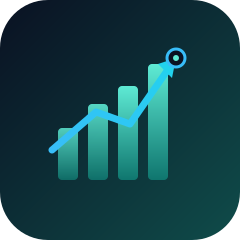
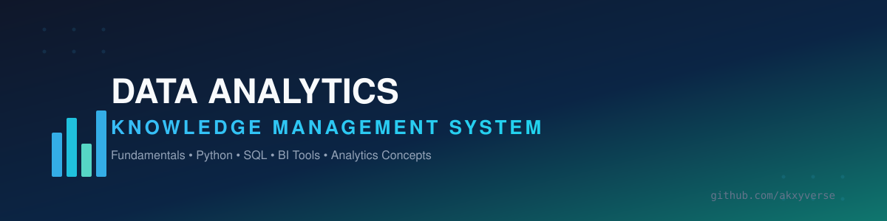
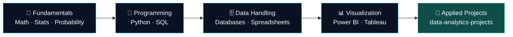

<div align="center">



<br><br>



<br><br>

[](./LICENSE)


### The core Data Analytics learning track of the Akxyverse ecosystem.
### Fundamentals → Programming → Data → BI Tools — structured, curated, always evolving.

</div>

<br>

<table>
<tr>
<td width="25%" align="center" valign="top">

**🧭 What**

A curated, public record of my core Data Analytics learning — fundamentals through BI tooling.

</td>
<td width="25%" align="center" valign="top">

**💡 Why**

Skills scattered across notes apps disappear. Structured, versioned, public notes don't.

</td>
<td width="25%" align="center" valign="top">

**👥 Who**

Learners, recruiters, and hiring managers evaluating depth — not just finished projects.

</td>
<td width="25%" align="center" valign="top">

**🎁 Value**

A ready-made, freely reusable template for anyone building their own learning system.

</td>
</tr>
</table>

<div align="center">

### 🧭 Explore the Ecosystem

</div>

<table>
<tr>
<td align="center" width="12.5%"><a href="https://github.com/akxyverse"><b>🏠</b><br><sub>Profile</sub></a></td>
<td align="center" width="12.5%"><b>🧠</b><br><sub>Knowledge Hub</sub></td>
<td align="center" width="12.5%"><a href="https://github.com/akxyverse/data-analytics-projects"><b>🚀</b><br><sub>Projects</sub></a></td>
<td align="center" width="12.5%"><a href="https://github.com/akxyverse/datasets"><b>📦</b><br><sub>Datasets</sub></a></td>
<td align="center" width="12.5%"><a href="https://github.com/akxyverse/data-analytics-resources"><b>📚</b><br><sub>Resources</sub></a></td>
<td align="center" width="12.5%"><a href="https://github.com/akxyverse/career-hub"><b>💼</b><br><sub>Career</sub></a></td>
<td align="center" width="12.5%"><a href="https://github.com/akxyverse/content-studio"><b>✍️</b><br><sub>Content</sub></a></td>
<td align="center" width="12.5%"><a href="https://github.com/akxyverse/certifications"><b>🏅</b><br><sub>Certs</sub></a></td>
</tr>
</table>

<div align="center">
<a href="https://github.com/akxyverse/ai-automation"><b>🤖 AI Automation</b></a> — the advanced/specialized track, kept separate from core analytics
</div>

---

## 🗂 The Learning Track

<table>
<tr>
<td width="50%" valign="top">

### 🧮 Fundamentals of Data Analytics
The theoretical foundation — no tools, just the math and stats that make everything else make sense.

**Technologies:** Linear Algebra · Calculus · Discrete Math · Descriptive & Inferential Statistics · Probability

**Learning outcome:** Reason confidently about distributions, variance, and inference before ever touching a dataset.

📂 [Open folder](<./Fundamentals of Data Analytics>) &nbsp;·&nbsp; 📄 [Folder guide](<./Fundamentals of Data Analytics/README.md>)

</td>
<td width="50%" valign="top">

### 🛠️ Data Analytics Technologies
Every core tool used in day-to-day analytics — one home per topic, grouped by category.

**Technologies:** Python · SQL & Databases · Excel · Power BI · Tableau · Looker Studio · APIs · Git/GitHub

**Learning outcome:** Move from raw data to a cleaned, queried, visualized, version-controlled analysis.

📂 [Open folder](<./Data Analytics Technologies>) &nbsp;·&nbsp; 📄 [Folder guide](<./Data Analytics Technologies/README.md>)

</td>
</tr>
</table>

<details>
<summary><strong>📁 Full folder tree</strong></summary>

```
data-analytics-knowledge-system
│
├── Fundamentals of Data Analytics
│   ├── Mathematics (Linear Algebra, Calculus, Discrete Mathematics)
│   ├── Statistics (Descriptive Statistics, Inferential Statistics)
│   └── Probability
│
└── Data Analytics Technologies
    ├── Programming
    │   ├── Python (Python Fundamentals, Python Libraries: NumPy, Pandas,
    │   │   Matplotlib, Seaborn, Plotly, Polars, SciPy, Statsmodels, Requests, Others)
    │   └── Web Development (Streamlit)
    ├── Databases (SQL, MySQL, PostgreSQL, SQL Server, SQLite, MongoDB, Redis)
    ├── Spreadsheets (Excel)
    ├── Data Visualization (Power BI, Tableau, Looker Studio, Excel Dashboards)
    ├── Analytics Concepts (Data Analytics Concepts, Business Analytics, Data Storytelling)
    ├── APIs (REST APIs, GraphQL, Webhooks, Authentication)
    ├── Version Control (Git, GitHub)
    └── Other Tools
```

</details>

## 🗺 Learning Roadmap

<div align="center">

`1` **Fundamentals** → `2` **Programming** → `3` **Data Handling** → `4` **Visualization** → `5` 🚀 **Applied Projects**

</div>



<sub>Text equivalent for screen readers: Fundamentals → Programming → Data Handling → Visualization → Applied Projects (in the dedicated projects repository).</sub>

## 🧰 Tech Stack

<table>
<tr>
<td width="50%" valign="top">

**Programming & Web**


**Core Data Libraries**


</td>
<td width="50%" valign="top">

**Databases**


**Visualization & Tools**


</td>
</tr>
</table>

> Looking for TensorFlow, PyTorch, Scikit-learn, Cloud, or Generative/Agentic AI? Those live in [`ai-automation`](https://github.com/akxyverse/ai-automation) or locally for now (ML/DL) — not here, by design.

## 📘 Recommended Guidebooks

Complete, self-contained learning guides — including the Excel Roadmap Guide — now live in [`Learning Resources → Guidebooks`](https://github.com/akxyverse/data-analytics-resources/tree/main/Guidebooks), so there's one home for them instead of two.

## 🎯 How to Use This Repository

1. **Start with fundamentals** — [Fundamentals of Data Analytics](<./Fundamentals of Data Analytics>) if you're building from zero.
2. **Move to tools** — [Data Analytics Technologies](<./Data Analytics Technologies>) once the theory is solid.
3. **Go apply it** — real, hands-on work lives in [`data-analytics-projects`](https://github.com/akxyverse/data-analytics-projects), not here.

## 🟢 Status

| Category | Status |
|----------|--------|
| Fundamentals of Data Analytics | ⚪ Not Started |
| Data Analytics Technologies | ⚪ Not Started |

🟢 Active · 🟡 Planned · ⚪ Not Started · ✅ Complete

## ➡️ Recommended Next Repository

<div align="center">

### 🚀 [Data Analytics Projects](https://github.com/akxyverse/data-analytics-projects)
**Fundamentals mean nothing until they're applied.** This is where the theory here becomes real, hands-on work.

</div>

---

<div align="center">

[](https://github.com/akxyverse)
[](https://www.linkedin.com/in/akash-yadav-122a75288/)
[](#)

**⭐ Star this repo if the structure is useful to you.**

<sub>Part of the <a href="https://github.com/akxyverse"><b>Akxyverse</b></a> Data Analytics ecosystem · MIT Licensed · <a href="./LICENSE">LICENSE</a></sub>

</div>
